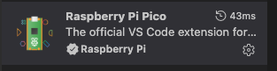

# dink-ii neotrellis grid - PicoSDK edition

This version is rewritten to use the Raspberry Pi PicoSDK and the Raspberry Pi Pico VS Code Extension. 

To get your environment setup in VSCode, first install the Raspberry Pi Pico VSCode Extension from the Extensions tab in VSCode.  

Then open the dinkii-neotrellis-iii directory in VSCode.



### Configuration

Look at the `# UPDATE HERE FOR YOUR BUILD` section of `CMakeLists.txt` to configure for your specific build. This *should* be the only configuration change needed, if at all.  

The default configuration is for a 128 build with standard i2c addresses as shown below:  
  
  
 

```
# Build defines
```

Set these according to your specific build  
```
    GRIDCOUNT=3   # must be number - options are:  1=4X4, 2=8x8, 3=16x8, 4=16x16 
```

### Building

Use the __Raspberry Pi Pico VS Code Extension__ to configure and build:

1. Open the project folder in VS Code  
2. Run **Raspberry Pi Pico: Configure CMake** from the Command Palette to generate the build directory  
3. Run **Raspberry Pi Pico: Build Project** (or press the build button in the status bar). 

The build output (`dinkii-neotrellis-iii.uf2`) will be in the `build/` directory.  

> **Note:** You do not need to wipe the `build/` folder between builds. CMake/Ninja performs incremental builds automatically — only changed files are recompiled. Only wipe the build folder if you change CMake configuration options (board type, SDK version, etc.) and the build behaves unexpectedly.  

To flash: hold the BOOTSEL button on the dinkii while plugging in USB - or hold both BOOTSEL and RESET and release RESET first - then drag-and-drop the `.uf2` file onto the RPI-RP2 mass storage drive that appears.  


### Device modes. 

The firmware supports two modes, stored in flash and persisted across power cycles and UF2 uploads:  

- **Mode 0 (iii)** — Lua scripting via iii. Connect to https://monome.org/diii in Chrome to use the interactive REPL. The device appears as a USB CDC serial port and MIDI device.  
- **Mode 1 (monome)** — Standard monome serial protocol over USB CDC. Use with serialosc and monome-compatible apps.  

To toggle between modes: hold key **(0,0)** (top-left) while the device is powering up.  

### i2c address configuration  

NeoTrellis tiles have I2C address jumpers (A0–A4) and a base address of `0x2E`. The addresses in `config.h` must match the physical jumper settings on your tiles.  

The reference address map (as shown in [neotrellis_addresses.jpg](https://github.com/okyeron/neotrellis-monome/blob/main/neotrellis_addresses.jpg)) lists tiles left-to-right:  

**16×8 (ONETWENTYEIGHT) — 8 tiles:**

| | col 1 | col 2 | col 3 | col 4 |
|---|---|---|---|---|
| **Row 1 (top)** | none → `0x2E` | A0 → `0x2F` | A1 → `0x30` | A2 → `0x32` |
| **Row 2 (bottom)** | A3 → `0x36` | A4 → `0x3E` | A0+A1 → `0x31` | A0+A2 → `0x33` |

**8×8 (SIXTYFOUR) — 4 tiles:**

| | col 1 | col 2 |
|---|---|---|
| **Row 1 (top)** | none → `0x2E` | A0 → `0x2F` |
| **Row 2 (bottom)** | A3 → `0x36` | A4 → `0x3E` |

Note: the arrays in `config.h` are written right-to-left (matching the pixel index ordering), which is the mirror of the picture. If your grid's first column responds to the wrong tile, swap the address order in `config.h`:

```c
// ONETWENTYEIGHT
const uint8_t addrRowOne[4] = {0x32, 0x30, 0x2F, 0x2E};
const uint8_t addrRowTwo[4] = {0x33, 0x31, 0x3E, 0x36};

// SIXTYFOUR
static const uint8_t addrRowOne[2] = {0x2F, 0x2E};
static const uint8_t addrRowTwo[2] = {0x3E, 0x36};
```

If you're not using the default address configuration, update these arrays in `config.h` to match your boards.

### LED color and brightness

All LED settings are in `config.h`:

```
#define BRIGHTNESS 96   // overall brightness (lower = dimmer; may need reduction for larger grids)

#define R 255           // red component   (0–255)
#define G 255           // green component (0–255)
#define B 255           // blue component  (0–255)

// gamma table for 16 brightness levels (monome uses 0–15)
static const uint8_t gammaTable[16] = {0, 2, 3, 6, 11, 18, 25, 32,
                                       41, 59, 70, 80, 92, 103, 115, 127};
static const uint8_t gammaAdj = 1; // multiply gamma output by 1 or 2
```

For example, to use a green-tinted color:
```
// Seafoam / Mint Green
#define R 73
#define G 214
#define B 148
```

`BRIGHTNESS` caps the overall output — useful if NeoPixels are too bright when powered over USB. `gammaAdj` can be set to `2` to boost perceived brightness at lower levels.
